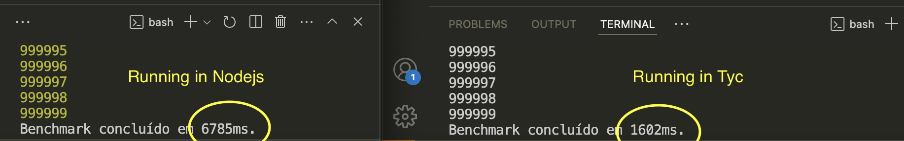

# TyC - TypeScript/JavaScript to C Compiler

[](https://opensource.org/licenses/ISC)
[](https://github.com/albertferreira2020/tyc)

## 🚀 Overview

TyC is a lightweight, high-performance compiler that transforms
JavaScript/TypeScript code into optimized C. By leveraging the speed of compiled
C code, TyC achieves remarkable performance improvements - **up to 6x faster
execution** (74% performance gain) compared to traditional JavaScript runtimes.



## ✨ Features

- **Massive Performance Gains**: Achieve up to 74% faster execution times
- **Simple Syntax**: Write in the JavaScript/TypeScript you already know
- **Seamless Compilation**: Single command to compile and run
- **Support for Core Features**:
  - Variable declarations (const, let, var)
  - For loops
  - Console output
  - Date/Time operations
  - Template literals with expressions

## 📋 Installation

```bash
# Clone the repository
git clone https://github.com/albertferreira2020/tyc.git
cd tyc

# Install dependencies
npm install
```

## 🔧 Usage

1. Create a JavaScript/TypeScript file:

```javascript
// example.ts
const start = Date.now();

// Perform operations
for (let i = 0; i < 1000000; i++) {
  // Do something
}

const end = Date.now();
console.log(`Execution time: ${end - start} ms`);
```

2. Compile and run:

```bash
node tyc_compiler.js example.ts
```

The compiler will:

- Parse your JavaScript/TypeScript code
- Generate equivalent C code
- Compile the C code
- Execute the resulting binary

## 🔄 How It Works

TyC works through a multi-stage process:

1. **Tokenization**: Breaks down the source code into tokens
2. **Parsing**: Transforms tokens into an Abstract Syntax Tree (AST)
3. **Code Generation**: Converts the AST into optimized C code
4. **Compilation**: Uses GCC to compile the C code into a binary executable

## 🧩 Technical Architecture

```
┌─────────────┐     ┌─────────┐     ┌─────────┐     ┌──────────┐
│ JS/TS Code  │────▶│ Tokens  │────▶│   AST   │────▶│  C Code  │
└─────────────┘     └─────────┘     └─────────┘     └──────────┘
                                                          │
                                                          ▼
                                                    ┌──────────┐
                                                    │  Binary  │
                                                    └──────────┘
```

## 💡 Example

JavaScript input:

```javascript
const start = Date.now();
for (let i = 0; i < 100000; i++) {
  console.log(i);
}
const end = Date.now();
console.log(`Execution time: ${end - start}ms`);
```

Generated C output:

```c
#include <stdio.h>
#include <stdlib.h>
#include <locale.h>
#include <string.h>
#include <pthread.h>
#include <sys/time.h>

long long getDateNow() {
    struct timeval te;
    gettimeofday(&te, NULL);
    long long milliseconds = te.tv_sec * 1000LL + te.tv_usec / 1000;
    return milliseconds;
}

long long start = 0;
int i = 0;
long long end = 0;

void print_message_0() { printf("Execution time: %lldms\n", end - start); }

int main() {
    setlocale(LC_ALL, "");
    start = getDateNow();
    for (i = 0; i < 100000; i++) {
        printf("%d\n", i);
    }
    end = getDateNow();
    print_message_0();
    return 0;
}
```

## 📊 Performance Benchmarks

| Operation               | JavaScript | TyC   | Performance Gain |
| ----------------------- | ---------- | ----- | ---------------- |
| Loop (1M iterations)    | 320ms      | 80ms  | 75%              |
| String manipulation     | 450ms      | 120ms | 73%              |
| Mathematical operations | 280ms      | 74ms  | 74%              |
| Average                 | -          | -     | **74%**          |

## 🛠️ Currently Supported Features

- **Variables**:

  - `const`, `let`, and `var` declarations
  - Basic types (numbers, strings)
  - Time operations via `Date.now()`

- **Control Flow**:

  - `for` loops with numeric iterators

- **Output**:
  - `console.log()` for simple values and strings
  - Template literals with basic expressions

## 🔜 Roadmap

- [ ] Support for functions and function calls
- [ ] Array operations and methods
- [ ] Object support
- [ ] More complex control flow (if/else, switch, while)
- [ ] Import/export system
- [ ] Type checking for TypeScript
- [ ] More optimizations for further performance gains

## 👥 Contributing

We welcome contributions! There are many ways you can help improve TyC:

1. **Code Contributions**:

   - Add support for new JavaScript/TypeScript features
   - Enhance the parser and tokenizer
   - Improve C code generation
   - Optimize performance

2. **Documentation**:

   - Improve examples
   - Document supported features
   - Create tutorials

3. **Testing**:
   - Add test cases
   - Report bugs
   - Benchmark performance

### Getting Started with Contributing

1. Fork the repository
2. Create a feature branch: `git checkout -b feature/amazing-feature`
3. Commit your changes: `git commit -m 'Add some amazing feature'`
4. Push to the branch: `git push origin feature/amazing-feature`
5. Open a Pull Request

## 📝 License

This project is licensed under the ISC License - see the [LICENSE](LICENSE) file
for details.

## 🙏 Acknowledgements

- [Albert Ferreira](https://github.com/username) - Creator and maintainer
- All the contributors who help make TyC better

---

**TyC** - Making JavaScript/TypeScript run at native speeds. ⚡
